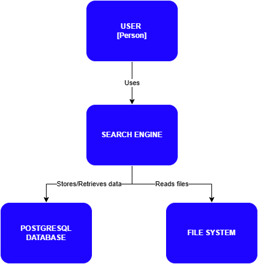
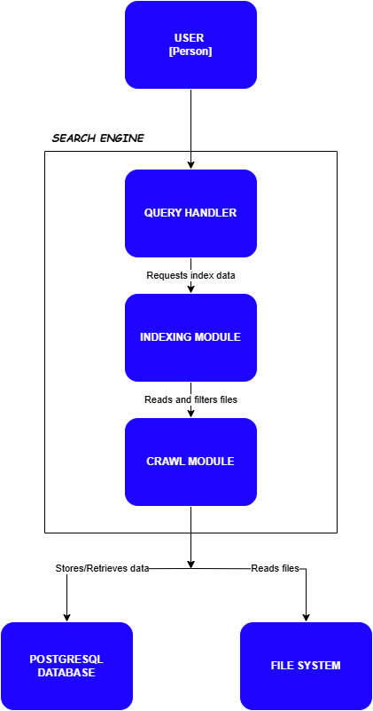
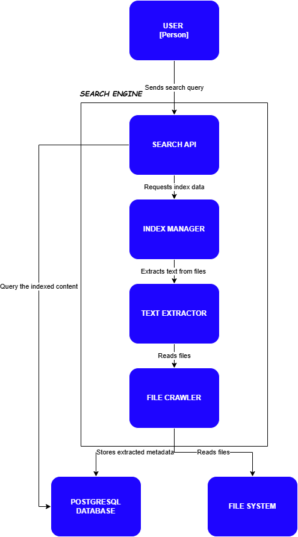

# Search Engine Architecture2

## Documentation
This document describes the architecture of the search engine, designed to crawl local content, filter unwanted data, store it in a PostgreSQL database, and process search queries.

## C4 Model Overview
The system follows the C4 Model with different levels of abstraction:

1. **System Context** - Defines the interaction between users and the search engine.
2. **Container Diagram** - Breaks down the system into major components.
3. **Component Diagram** - Details the internal structure of the search engine.

## 1. System Context Diagram

- **User** - A person that interacts with the search engine.
- **The search engine**:
  - Stores and retrieves data from a PostgreSQL database.
  - Reads files from the File System (the storage of the computer).

## 2. Container Diagram

- **User** – A person making a search request.
- **Query Handler** – The module that receives search queries and retrieves index data.
- **Indexing Module** – Reads and filters files, preparing them for efficient searching.
- **Crawl Module** – Scans the file system and collects data to be indexed.
- **PostgreSQL Database** – Stores the indexed data for quick retrieval.
- **File System** – The raw storage of files that the crawler scans.
## 3. Component Diagram

- **User** - Sends search queries.
- **Search API** - Handles the query and interacts with the index.
- **Index Manager** - Manages and retrieves indexed content.
- **Text Extractor** - Extracts meaningful text from files.
- **File Crawler** - Reads raw files from the File System.
- **PostgreSQL Database** - Stores extracted metadata and indexed content.
- **File System** - Source of raw data before processing.

